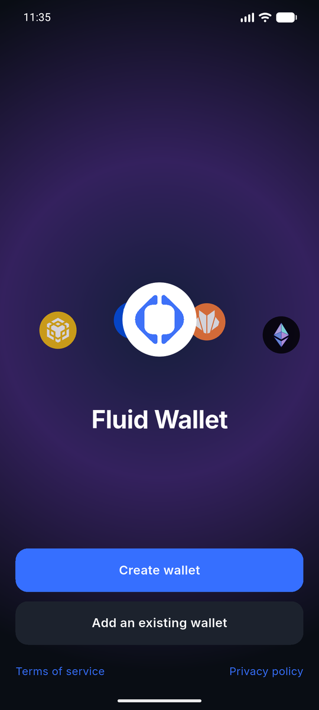
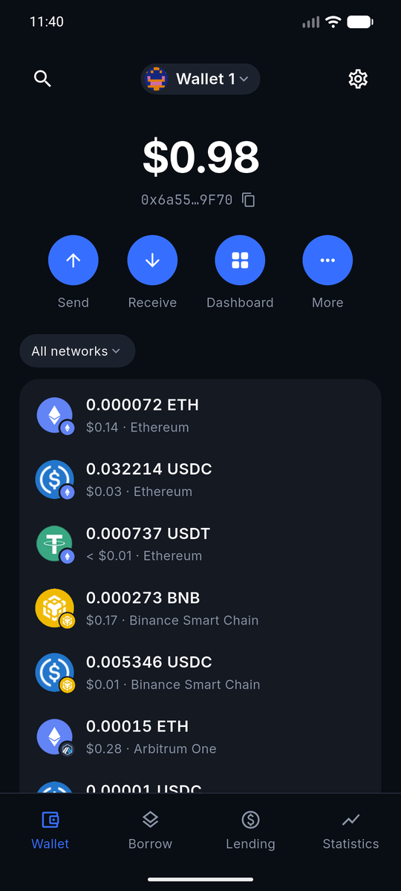
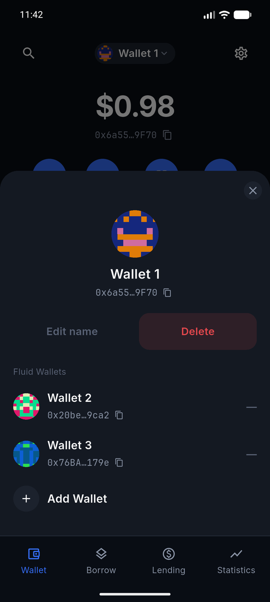
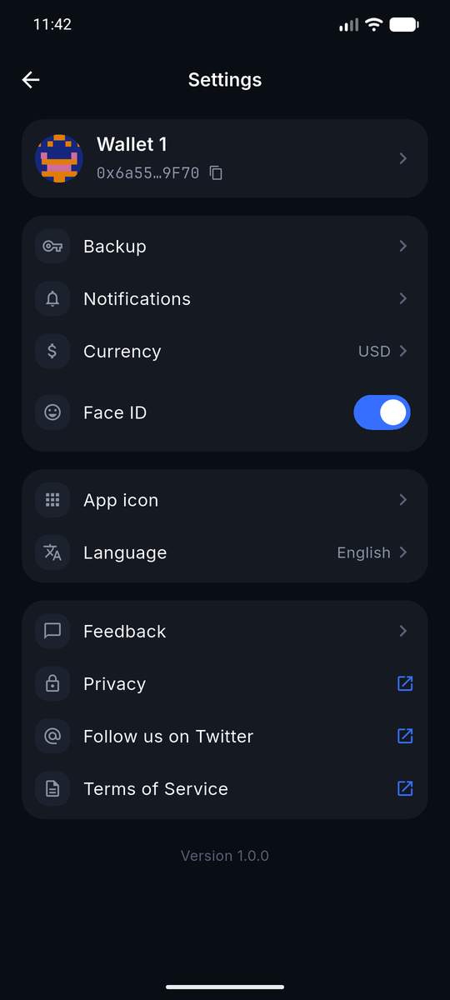

# Fluid Wallet

A self-custody, multi-chain EVM wallet built in Flutter. Keys are generated and
signed on the device; the only thing that ever leaves it is a public address.


<!-- CI badge goes here once the workflow lands. -->

|                       Get started                        |                       Portfolio                        |                       Wallet switcher                        |                       Settings                        |
| :------------------------------------------------------: | :----------------------------------------------------: | :----------------------------------------------------------: | :---------------------------------------------------: |
|  |  |  |  |

## Architecture

```
assets/config/chains-default.json   single source of truth for chains and tokens
lib/
  main.dart          parses and validates the registry before runApp
  app/               router.dart (go_router + wallet guard), theme/ (design tokens)
  core/              chain-agnostic primitives, no Flutter widgets
    crypto/          mnemonic.dart, key_derivation.dart
    money/           token_amount.dart, fiat.dart, formatters.dart
    network/         dio client, rate limiter, retry interceptor
    security/        secure_store.dart
  data/              chain registry, freezed models, providers, repositories
  features/          one folder per screen: onboarding, wallet, settings, …
  shared/widgets/    design-system widgets: buttons, sheets, token rows
```

Two rules hold the layers together: `features/` never hardcodes style — colors,
text and spacing come from theme tokens, because a hand-built `TextStyle` on a
balance loses tabular figures and the number jitters on refresh. And every
derived provider is keyed by `(address, chainId, tokenAddress)` rather than being
a singleton, which is what makes switching wallets a one-line state change
instead of a cache-invalidation problem.

## Tech stack

| Layer                     | Choice                                                                      |
| ------------------------- | --------------------------------------------------------------------------- |
| State                     | `flutter_riverpod` 3                                                        |
| Routing                   | `go_router` 17, with a redirect guard on wallet existence                   |
| Models                    | `freezed` + `json_serializable`                                             |
| Networking                | `dio`, with a rate limiter and retry interceptor for free-tier APIs         |
| Money                     | `decimal` — `BigInt` → `Decimal` → `String`, never `double`                 |
| Key path (pinned exactly) | `flutter_secure_storage` 10.3.1, `blockchain_utils` 7.1.0, `web3dart` 3.0.3 |
| Data sources              | Alchemy (balances), CoinGecko (prices)                                      |
| Type                      | Inter for UI, JetBrains Mono for addresses and tx hashes                    |

## Getting started

Requires the Flutter SDK on Dart 3.11 or newer (`flutter --version`) and a
running Android emulator or iOS simulator.

**1. Clone and install dependencies**

```bash
git clone https://github.com/chankiet1804/Fluid-Wallet.git
cd Fluid-Wallet
flutter pub get
```

**2. Generate the freezed / json_serializable code**

```bash
dart run build_runner build --delete-conflicting-outputs
```

**3. Add your API keys**

Create `env.json` in the repo root. It is gitignored — keys never live in code
and never get committed.

```json
{
  "ALCHEMY_API_KEY": "your-alchemy-key",
  "COINGECKO_API_KEY": ""
}
```

Get a free key at [alchemy.com](https://www.alchemy.com/) and enable the networks
you want balances for. `COINGECKO_API_KEY` can stay empty — the free price tier
needs no key.

**4. Run**

```bash
flutter run --dart-define-from-file=env.json
```

The `--dart-define-from-file` flag is required; without it the app still starts
but every network fails to load. In VS Code, the **fluid_wallet (env)** launch
configuration passes it for you.

> **Note for release builds:** restrict the Alchemy key to this app's package
> name and set a spend cap on the dashboard. A key inside a shipped mobile binary
> is extractable.

## Tests

```bash
flutter test
```

17 test files, ~2,900 lines — key derivation, exact-decimal arithmetic, registry
validation, portfolio failure states, and the onboarding and wallet-switching
flows as widget tests. Two are load-bearing rather than routine:
[`key_derivation_test.dart`](test/core/crypto/key_derivation_test.dart) asserts
the official BIP39 vectors byte for byte, and
[`token_decimals_test.dart`](test/data/chain/token_decimals_test.dart) pins
stablecoin decimals per chain.

## Roadmap

- [x] **Phase 0** — Foundation: design tokens, sheet primitives, `SecureStore`.
      RASP and obfuscated release builds still outstanding.
- [x] **Phase 1** — Onboarding: create, import, backup, verify. BIP39 vectors and
      the derivation-path convention are locked by tests.
- [x] **Phase 2** — Multi-chain portfolio, prices, partial-failure handling.
      Receive / QR is the remaining piece of this phase.
- [ ] **Phase 3** — History: Etherscan V2, cached in drift, keyed by
      `(address, chainId, txHash)`
- [ ] **Phase 4** — Send: EIP-55 validation, EIP-1559 gas, `eth_call` simulation
      before broadcast
- [ ] **Phase 5** — Swap: 0x Swap API v2, exact-amount approvals, price-impact
      guard
- [ ] **Phase 6** — Hardening: biometric gate, auto-lock, `FLAG_SECURE`,
      localisation

## Security notice

An educational project, not an audited wallet. It has no biometric gate and no
screenshot protection yet, so a recovery phrase is visible to anyone who can
unlock the phone. Generate a fresh wallet for it and treat that seed as already
compromised.

## Credits

Network and token icons from [web3icons](https://github.com/0xa3k5/web3icons)
(MIT). Typefaces: Inter and JetBrains Mono, both SIL Open Font License.
